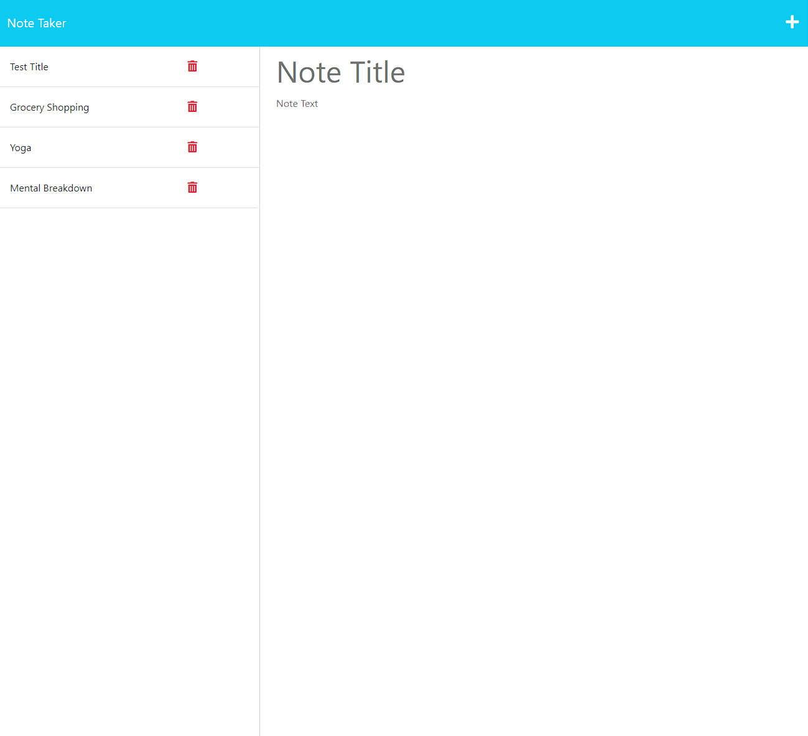

# Express.js NoteTaker

## Description
This note app takes user input and stores it to a .json array to create persistence.

## Installation
Visit the app domain on Heroku [Express NoteTaker](https://warm-basin-11114.herokuapp.com/notes)

## Usage
When you enter a title and text in the field, a save button will appear. Upon saving, the data will be stored to the db.json file and will append to the list on the lefthand side. (right now its not functioning properly and the server has to be reset to apply these changes)

## Credits
n/a